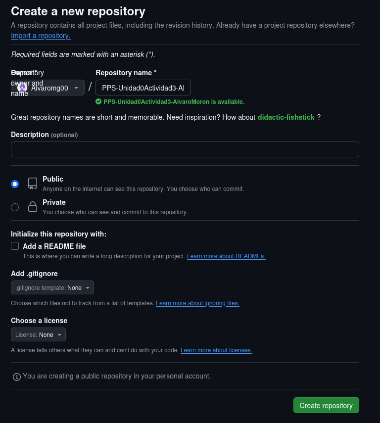
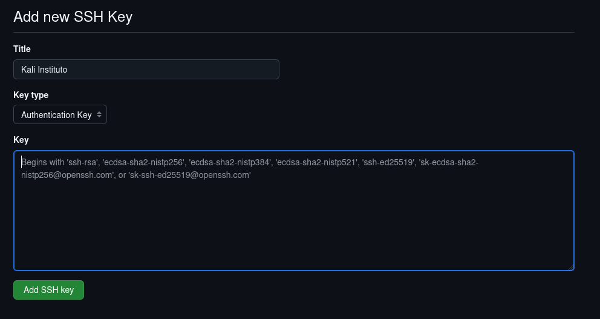
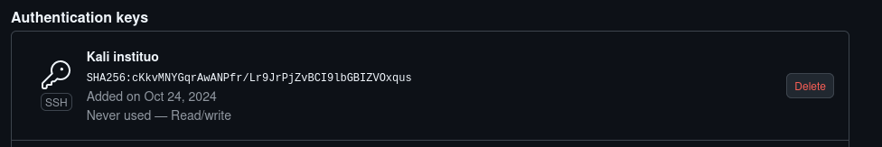
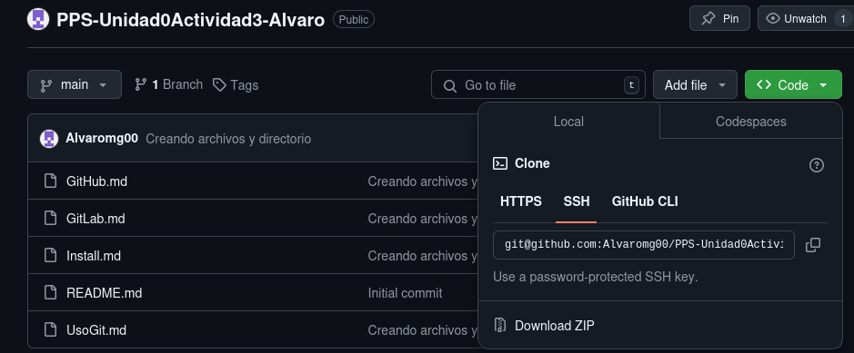

# Uso básico de GitHub

Lo primero es abrir una cuenta en GitHub, para ello accedemos al apartado de sign up de la página web de [GitHub](https://github.com/signup?ref_cta=Sign+up&ref_loc=header+logged+out&ref_page=%2F&source=header-home).

1. Una vez aqui deberemos registrarnos con nuestro email y contraseña: 
2. Al registrarnos ya podremos iniciar sesión, para ello nos vamos a sign in y nos logueamos: 
3. Despúes al acceder a nuestra cuenta le tendremos que dar al boton de new y rellenar los datos del nuevo repositorio: 
4. Una vez creado el repositorio tenemos que configurar el ssh para ello abrimos la terminal y escribimos ```ssh-keygen -t rsa``` lo que creará nuestro par de claves publica y privada en dos archivos llamados id_rsa y id_rsa.pub, el que nos interesa es id_rsa.pub ya que es el que contiene la clave pública que tendremos que introducir mas tarde en GitHub.
5. Ponemos ```sudo cat /home/kali/.ssh/id_rsa.pub``` para que nos muestre el contenido del ese archivo y lo copiamos.
6. Ahora vamos a GitHub y le damos a nuestra foto de perfil a la derecha, en el menu desplegable le damos a *Settings*: 
7. Ahora en las opciones de la izquierda le damos a *SSH and GPG keys*: 
8. Le damos a *New SSH Key*: 
9. Aquí introducimos un nombre para la SSH Key y en el apartado de Key pegamos la clave pública que copiamos anteriormente: 
10. Una vez hecho esto ya nos mostrará GitHub la clave SSH y podremos clonarnos los repositorios en nuestro equipo por SSH: 
